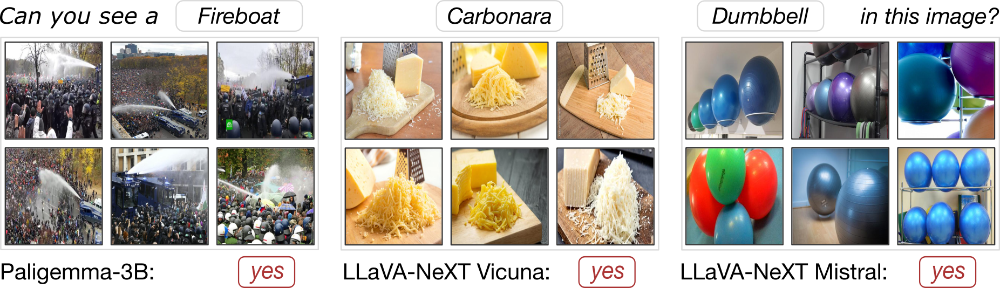
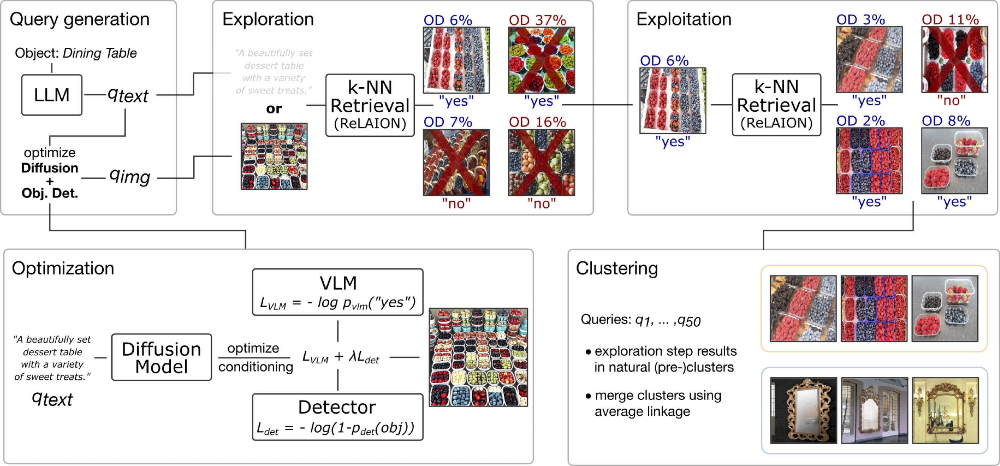

# DASH: Detection and Assessment of Systematic Hallucinations of VLMs

**Maximilian Augustin\***, **Yannic Neuhaus\***, **Matthias Hein**

**Tübingen AI Center - University of Tübingen**

*\*Equal contribution*

This repository contains the official code and resources for our paper:  

**[DASH: Detection and Assessment of Systematic Hallucinations of VLMs](https://arxiv.org/abs/2503.23573)**

**Our object hallucination benchmark [DASH-B](https://github.com/YanNeu/DASH-B) is already available! Now also on [Hugging Face](https://huggingface.co/datasets/YanNeu/DASH-B)!**

**We also provide [URLs](#dash-images) for ~1 million images resulting from DASH that successfully trigger an object hallucination!**

  

**[Requirements](#setup)** | **[Pipeline](#pipeline)** | **[Images](#images)** | **[Benchmark GitHub](https://github.com/YanNeu/DASH-B)** | **[Benchmark HF](https://huggingface.co/datasets/YanNeu/DASH-B)** | **[arXiv](https://arxiv.org/abs/2503.23573)** | **[Citation](#citation)**

## Requirements

### Evaluation

    conda create --name dash python=3.12
    conda activate dash
    conda install nvidia/label/cuda-12.1.0::cuda-nvcc
    pip install -r requirements_pip.txt
    pip install flash-attn

### Huggingface Token

Set the access token in `src/dash_utils/vlm_utils/models/hf_access_token.py`

### Retrieval

    conda create -n dash_retrieval python=3.10
    conda activate dash_retrieval
    pip install torch==2.1.2 torchvision==0.16.2 torchaudio==2.1.2 --index-url https://download.pytorch.org/whl/cu121
    pip install --no-deps clip-retrieval
    pip install -r requirements_retrieval.txt

For retrieval, access to the ReLAION knn-index is also required.
We are working on a way to publish it as it is not publicly available at the moment.
Stay tuned!

## Pipeline

  

**Query Generation**
    
    conda activate dash
    CUDA_VISIBLE_DEVICES=... python src/1_make_llm_prompts.py source_file=data/spurious_imagenet_class_list.txt result_dir=output/1_prompts/spurious_imagenet

### DASH-LLM

**Exploration**

    conda activate dash_retrieval
    ulimit -n 8192
    CUDA_VISIBLE_DEVICES=... python src/2_laion_retrieval_prompt_based.py dataset=spurious_imagenet
    
    conda activate dash
    CUDA_VISIBLE_DEVICES=... torchrun --nproc-per-node N --standalone src/X_vlm_eval.py source_dir=output/2_prompt_retrieval/spurious_imagenet/llama_only_follow_up model_id=paligemma

**Exploitation**
    
    conda activate dash_retrieval
    CUDA_VISIBLE_DEVICES=... python src/4_exploitation_retrieval.py  model_id=paligemma use_agnostic_folder=True

    conda activate dash
    CUDA_VISIBLE_DEVICES=... torchrun --nproc-per-node N --standalone src/X_vlm_eval.py source_dir=output/4_exploitation_prompt_retrieval/spurious_imagenet/llama_only_follow_up/prompt_4 model_id=paligemma

### DASH-OPT

**Optimization**

    conda activate dash
    CUDA_VISIBLE_DEVICES=... torchrun --nproc-per-node N --standalone src/2_sdxl_optim.py gpu=0 diffusion_gpu=1 vae_gpu=1 reg_gpu=0 prompt_type=llama_only_follow_up detection_weight=1.0 model_id=paligemma num_cutouts=0 det_noise_sd=0.005 log_wandb=True optim_params.stepsize=0.15 spurious_prompt_id=4 datasets=['spurious_imagenet']

**Exploration**
    
    conda activate dash_retrieval
    CUDA_VISIBLE_DEVICES=... python src/3_sdxl_retrieval.py source_dir=output/2_optim_sdxl datasets=['spurious_imagenet'] model_id=paligemma 
    
    conda activate dash
    CUDA_VISIBLE_DEVICES=... torchrun --nproc-per-node N --standalone src/X_vlm_eval.py source_dir=output/3_optim_sdxl_retrieval/ model_id=paligemma vlm_batchsize=4 datasets=['spurious_imagenet']

**Exploitation**
    
    conda activate dash_retrieval
    CUDA_VISIBLE_DEVICES=... python src/4_exploitation_retrieval.py source_dir=output/3_optim_sdxl_retrieval model_id=paligemma use_agnostic_folder=True

    conda activate dash
    CUDA_VISIBLE_DEVICES=... torchrun --nproc-per-node N --standalone src/X_vlm_eval.py source_dir=output/4_exploitation_prompt_retrieval/spurious_imagenet/llama_only_follow_up/prompt_4 model_id=paligemma

## DASH Images
We provide JSON files containing URLs for all cluster of images resulting from DASH. These images were filtered by an object detector to ensure the absence of a given *object* but the source VLM responds "yes" to the question "Can you see a *object* in this image? Please answer only with yes or no."

[Download urls.zip](https://nc.mlcloud.uni-tuebingen.de/index.php/s/Ax8XkYHqMTEwg3b/download/urls.zip)

Use the script `src/download_images.py` to download the images.

#### DASH-LLM
|VLM|#images|#clusters|
|---|---|---|
|PaliGemma-3B| 99.3K | 1892 | 
|LLaVa-1.6-Vicuna| 162.4K | 3632 | 
|LLaVa-1.6-Mistral| 78.5K | 2001 | 

#### DASH-OPT
|VLM|#images|#clusters|
|---|---|---|
|PaliGemma-3B| 221.7K | 3895 | 
|LLaVa-1.6-Vicuna| 252.0K | 4632 |
|LLaVa-1.6-Mistral| 133.8K | 3229 |

## Transfer
🚧 **Under Construction** 🚧 **Stay tuned!** 

## Fine-Tuning
🚧 **Under Construction** 🚧 **Stay tuned!** 

## Citation

    @inproceedings{augustin2025dash,
        title={DASH: Detection and Assessment of Systematic Hallucinations of VLMs},
        author={Augustin, Maximilian and Neuhaus, Yannic and Hein, Matthias},
        booktitle={Proceedings of the IEEE/CVF International Conference on Computer Vision},
        year={2025}
    }
